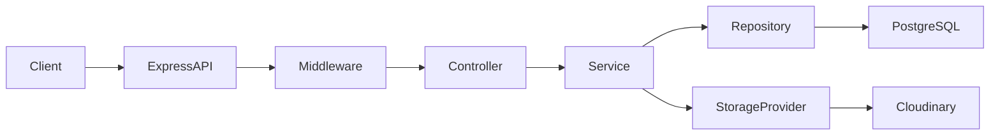

# Image Upload Service API

[](https://github.com/JesseDev454/image-upload-service-api/actions/workflows/ci.yml)

Backend API for uploading, validating, storing, listing, transforming, and deleting images. Images are stored in Cloudinary, metadata is persisted in PostgreSQL, and the service exposes a clean REST interface with Swagger documentation, automated tests, and GitHub Actions CI.

This project has been manually verified end-to-end against real PostgreSQL and Cloudinary instances.

## Why This Project

Many applications need a reliable way to upload, store, and deliver images.  
Handling uploads safely involves validation, cloud storage integration, metadata persistence, and scalable API design.

This project implements a production-style image upload service that demonstrates:

- clean backend architecture
- safe file handling
- cloud storage integration
- metadata persistence
- paginated API design
- automated testing and CI

It is designed as a reusable media service that could be integrated into larger applications such as SaaS platforms, admin dashboards, or e-commerce systems.

## Contents

- [Key Features](#key-features)
- [Technology Stack](#technology-stack)
- [Architecture Overview](#architecture-overview)
- [API Overview](#api-overview)
- [Example Request / Response](#example-request--response)
- [Running the Project Locally](#running-the-project-locally)
- [Environment Variables](#environment-variables)
- [Running Tests](#running-tests)
- [CI Pipeline](#ci-pipeline)
- [Project Structure](#project-structure)
- [Future Improvements](#future-improvements)
- [License](#license)

## Key Features

- Single image upload with MIME type, extension, and size validation
- Cloudinary integration for asset storage and transformation URL generation
- PostgreSQL metadata persistence with TypeORM
- Paginated upload listing with filtering by `format`, `mimeType`, `ownerType`, and `ownerId`
- Optional resource association via `ownerType` and `ownerId`
- Retrieve upload metadata by ID
- Delete uploaded assets from Cloudinary and PostgreSQL
- Swagger / OpenAPI documentation
- Unit and integration tests with Jest and Supertest
- GitHub Actions CI for lint, test, and build validation

## Technology Stack

**Backend**
- Node.js
- Express
- TypeScript
- TypeORM
- PostgreSQL
- Multer
- Cloudinary

**Tooling**
- Jest
- Supertest
- Swagger / OpenAPI
- ESLint
- Prettier
- GitHub Actions

## Architecture Overview

The project uses a layered backend structure to keep HTTP concerns, business logic, persistence, and infrastructure concerns separate.

- **Routes**: define endpoints and compose middleware
- **Controllers**: translate HTTP requests and responses
- **Services**: implement upload lifecycle business rules
- **Repositories**: handle database access through TypeORM
- **Providers**: implement infrastructure integrations such as Cloudinary
- **Middleware**: handle request IDs, upload parsing, and centralized error handling

The upload module depends on a storage provider contract rather than directly on Cloudinary-specific types. Cloudinary is implemented as an adapter behind that boundary, which keeps the service layer simpler and easier to extend later.

### Request Flow



## API Overview

Base path:

```text
/api/v1
```

Main endpoints:

- `POST /api/v1/uploads` — upload a single image
- `GET /api/v1/uploads` — list uploads with pagination and filters
- `GET /api/v1/uploads/:id` — get one upload by ID, optionally with transformation query params
- `DELETE /api/v1/uploads/:id` — delete an upload

### Listing Query Parameters

`GET /api/v1/uploads` supports:

- `page` — default `1`
- `limit` — default `20`, max `100`
- `format`
- `mimeType`
- `ownerType`
- `ownerId`

Example:

```text
GET /api/v1/uploads?page=1&limit=20&format=png&mimeType=image/png&ownerType=user&ownerId=user-123
```

Swagger UI is available at:

```text
http://localhost:4000/api-docs
```

## Example Request / Response

Upload an image with resource association:

```bash
curl -X POST http://localhost:4000/api/v1/uploads \
  -F "image=@./sample-avatar.jpg" \
  -F "ownerType=user" \
  -F "ownerId=user-123" \
  -F "folder=avatars"
```

Responses follow a consistent envelope structure:

- `success` indicates whether the request succeeded
- `message` provides a human-readable result
- `data` contains the resource payload
- `meta.requestId` helps trace requests in logs

Example successful upload response:

```json
{
  "success": true,
  "message": "Upload created successfully",
  "data": {
    "id": "21fe04e2-eb3b-4af2-b5d1-f502ae5a9f75",
    "originalName": "sample-avatar.jpg",
    "publicId": "avatars/2026/03/ade11602-6a0c-456c-8ebb-f511635ee3a2",
    "secureUrl": "https://res.cloudinary.com/your-cloud/image/upload/v1773357132/avatars/2026/03/ade11602-6a0c-456c-8ebb-f511635ee3a2.jpg",
    "format": "jpg",
    "mimeType": "image/jpeg",
    "width": 320,
    "height": 180,
    "sizeInBytes": 14782,
    "folder": "avatars",
    "resourceType": "image",
    "ownerType": "user",
    "ownerId": "user-123",
    "uploadedBy": null,
    "createdAt": "2026-03-12T23:12:12.631Z",
    "updatedAt": "2026-03-12T23:12:12.631Z",
    "deletedAt": null
  },
  "meta": {
    "requestId": "acc1c34e-a784-4043-9e19-236a9ff71fd7"
  }
}
```

## Running the Project Locally

### 1. Clone the repository

```bash
git clone https://github.com/JesseDev454/image-upload-service-api.git
cd image-upload-service-api
```

### 2. Install dependencies

```bash
npm install
```

### 3. Create your environment file

```bash
copy .env.example .env
```

If you are using Git Bash or WSL:

```bash
cp .env.example .env
```

### 4. Start PostgreSQL

Make sure PostgreSQL is running and the target database exists.

Example:

```sql
CREATE DATABASE file_upload_api;
```

### 5. Configure `.env`

Add your PostgreSQL and Cloudinary credentials.

### 6. Start the development server

```bash
npm run dev
```

### 7. Open the API docs

```text
http://localhost:4000/api-docs
```

## Environment Variables

Required environment variables:

| Variable | Description |
|---|---|
| `PORT` | Port the API server runs on |
| `DATABASE_HOST` | PostgreSQL host |
| `DATABASE_PORT` | PostgreSQL port |
| `DATABASE_USERNAME` | PostgreSQL username |
| `DATABASE_PASSWORD` | PostgreSQL password |
| `DATABASE_NAME` | PostgreSQL database name |
| `CLOUDINARY_CLOUD_NAME` | Cloudinary cloud name |
| `CLOUDINARY_API_KEY` | Cloudinary API key |
| `CLOUDINARY_API_SECRET` | Cloudinary API secret |

Typical local example:

```env
PORT=4000

DATABASE_HOST=localhost
DATABASE_PORT=5432
DATABASE_USERNAME=postgres
DATABASE_PASSWORD=postgres
DATABASE_NAME=file_upload_api

CLOUDINARY_CLOUD_NAME=your_cloud_name
CLOUDINARY_API_KEY=your_api_key
CLOUDINARY_API_SECRET=your_api_secret
```

## Running Tests

Run the full validation set:

```bash
npm run lint
npm test
npm run build
```

The test suite includes:

- unit tests for service and validation behavior
- integration tests for upload, list, get, delete, pagination, filtering, and error cases

## CI Pipeline

GitHub Actions runs on:

- `push`
- `pull_request`

The workflow performs:

1. dependency installation with `npm ci`
2. lint
3. tests
4. build

The CI setup does not require live Cloudinary credentials or a real PostgreSQL instance because the automated test suite uses in-memory doubles for repository and storage-provider boundaries.

## Project Structure

```text
src/
  config/
  common/
  middleware/
  modules/
    uploads/
      contracts/
      controllers/
      dto/
      entities/
      repositories/
      routes/
      services/
      types/
  providers/
    cloudinary/
  utils/
  app.ts
  server.ts

tests/
  integration/
  unit/
  helpers/
  mocks/

docs/
```

## Future Improvements

Planned but intentionally out of scope for the current version:

- multi-file upload
- soft delete / restore
- image replacement
- auth and authorization
- rate limiting
- named image variants
- signed direct upload flows

## License

MIT
