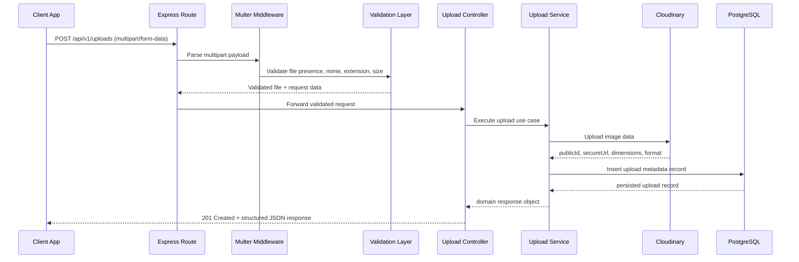

# System Architecture

## Architectural Style
Modular monolith with layered architecture:
- Routes
- Middleware
- Controllers
- Services
- Repositories (TypeORM)
- Entities
- Providers (Cloudinary)
- Config/Common/Utils

## Why This Architecture
- Keeps business logic isolated from HTTP and infrastructure concerns.
- Improves testability and maintainability.
- Fits a solo portfolio project without microservice complexity.
- Enables straightforward post-MVP extensions (auth, rate limiting, soft delete).

## Request Flow
`Client -> Route -> Multer Middleware -> Validation -> Controller -> Service -> Cloudinary + Repository -> Response`

## Responsibility Mapping
- **Upload parsing:** `src/middleware/upload.middleware.ts`
- **Validation:** upload middleware + service validation.
- **Cloudinary integration:** `src/providers/cloudinary`
- **Transformation URL logic:** `UploadService` using cloud provider adapter.
- **DB operations:** `TypeOrmUploadRepository`
- **Error normalization:** `src/middleware/error-handler.middleware.ts`
- **Centralized configuration:** `src/config`

## Tradeoffs
- **Pros:** Fast delivery, simple deployment model, clear code boundaries.
- **Cons:** Single deployable unit; no independent horizontal scaling by module.
- **Decision:** Acceptable for MVP and portfolio scope.

## High-Level Architecture Diagram
```mermaid
flowchart LR
    Client[Client App]
    Response[JSON Response]
    Swagger[Swagger Docs / OpenAPI]

    subgraph API[Express API Service]
      Routes[Routes]
      UploadMW[Upload Middleware (Multer)]
      Ctrl[Upload Controller]
      Svc[Upload Service]
      Repo[Upload Repository (TypeORM)]
      Provider[Cloudinary Provider]
      Err[Global Error Middleware]
    end

    DB[(PostgreSQL)]
    Cloud[(Cloudinary)]

    Client -->|HTTP Request| Routes
    Swagger -->|API contract reference| Routes
    Routes --> UploadMW --> Ctrl --> Svc
    Svc --> Provider --> Cloud
    Svc --> Repo --> DB
    Svc --> Ctrl --> Routes --> Err --> Response --> Client
```

## Upload Request Flow Diagram

