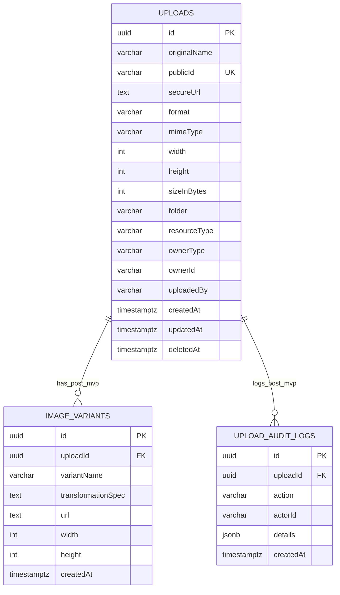

# Database Design

## Database Choice
**PostgreSQL** is selected for:
- Strong constraints and indexing support.
- Reliable TypeORM integration.
- Native UUID and robust timestamp handling.
- Better long-term schema flexibility for audit/variant extensions.

## Main Entity: `uploads`

| Field | Type | Required | Purpose | Notes |
|---|---|---|---|---|
| `id` | `uuid` | Yes | Primary key | Generated UUID |
| `originalName` | `varchar(255)` | Yes | Original file name | Sanitized before persistence |
| `publicId` | `varchar(255)` | Yes | Cloudinary asset ID | Unique |
| `secureUrl` | `text` | Yes | Cloud-delivered HTTPS URL | Returned to clients |
| `format` | `varchar(20)` | Yes | Stored image format | From provider response |
| `mimeType` | `varchar(100)` | Yes | Uploaded MIME type | Validated allow-list |
| `width` | `integer` | Yes | Image width in pixels | Positive integer |
| `height` | `integer` | Yes | Image height in pixels | Positive integer |
| `sizeInBytes` | `integer` | Yes | File size for auditing/limits | Positive integer |
| `folder` | `varchar(120)` | No | Logical grouping | Optional |
| `resourceType` | `varchar(20)` | Yes | Provider resource type | Defaults to `image` |
| `ownerType` | `varchar(50)` | No | Business entity type | Optional pair with `ownerId` |
| `ownerId` | `varchar(100)` | No | Business entity identifier | Optional pair with `ownerType` |
| `uploadedBy` | `varchar(100)` | No | Actor identifier | Optional |
| `createdAt` | `timestamptz` | Yes | Creation timestamp | Auto |
| `updatedAt` | `timestamptz` | Yes | Update timestamp | Auto |
| `deletedAt` | `timestamptz` | No | Soft delete marker | Reserved for post-MVP |

## Constraints and Indexing
- Primary key: `id` (UUID)
- Unique: `publicId`
- Indexes:
  - `idx_uploads_created_at` on `createdAt`
  - `idx_uploads_owner` on (`ownerType`, `ownerId`)
  - `idx_uploads_folder` on `folder`

## Nullable Field Rules
- `ownerType` and `ownerId` are optional but validated as pair at service level.
- `folder`, `uploadedBy`, and `deletedAt` are optional.

## Soft Delete Strategy
- Column exists in schema now (`deletedAt`).
- MVP uses hard delete for simplicity.
- Post-MVP may switch to soft delete semantics with `deletedAt` updates and filtered queries.

## Optional Post-MVP Tables

### `image_variants` (Post-MVP)
Used when fixed named variants need persistence.
- Relationship: many variants per upload (`uploads 1 - N image_variants`).
- Unique: (`uploadId`, `variantName`).

### `upload_audit_logs` (Post-MVP)
Used for operational history and accountability.
- Relationship: many logs per upload (`uploads 1 - N upload_audit_logs`).

## Variant Strategy Recommendation
MVP uses **dynamic transformation URL generation** from `publicId` + query params.  
Persisted variants are deferred until there is a concrete requirement for named, immutable presets.

## ER Diagram

